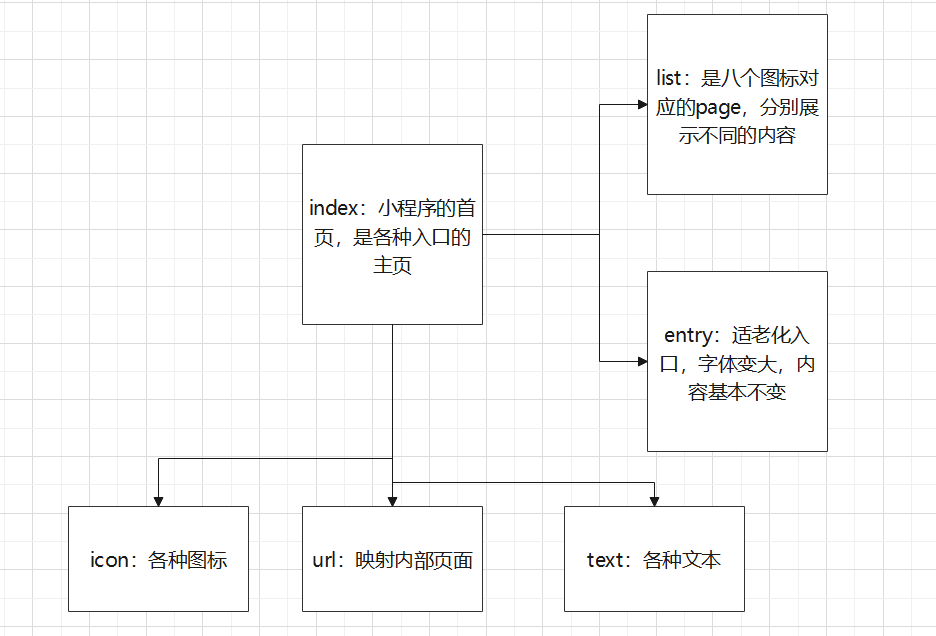
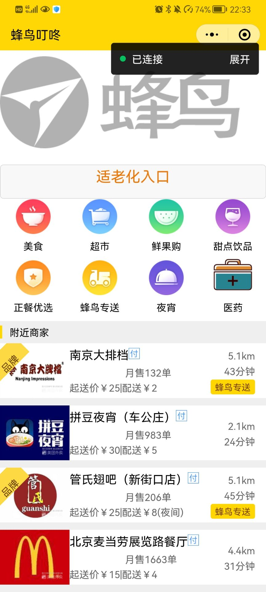
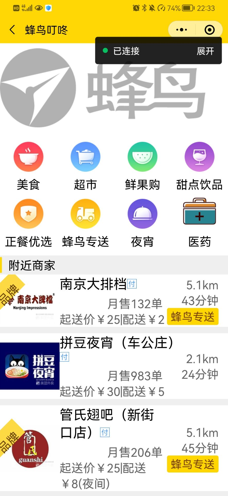
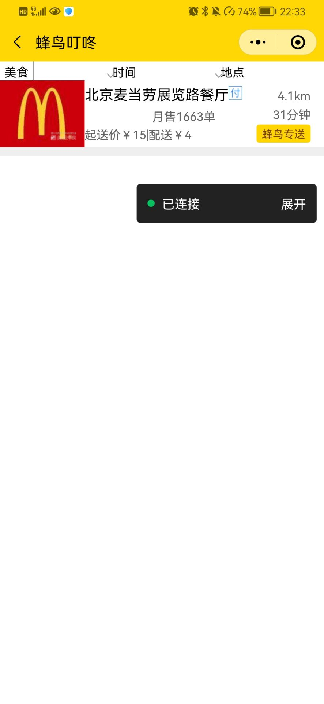

# 微信小程序——蜂鸟叮咚

## 配置环境

系统环境：Windows 10

体验环境：Android/iOS系统的微信APP

工具：

- 微信开发者工具Stable 1.05.2110110
- Visual Studio Code 2021

## 整体思想

写三个页面，分别是index，list，entry，分别代表小程序首页、列表的内容和适老化入口。

## 实现逻辑

- 配置json文件

在app.json中加入以下代码，说明小程序的信息。

```json
{
    "pages": [
        "pages/index/index",
        "pages/index/list",
        "pages/index/entry",
        "pages/logs/logs"
    ],
    "window": {
        "backgroundTextStyle": "light",
        "navigationBarBackgroundColor": "#ffd705",
        "navigationBarTitleText": "蜂鸟叮咚",
        "navigationBarTextStyle": "black"
    },
    "sitemapLocation": "sitemap.json"
}
```

- 首页index

  - index.wxml通过navigator标签获取内部页url来跳转其他页面，view标签查看文本和图片

  ```html
  <!--index.wxml-->
  <view class="container">
    <image class="banner" mode="aspectFit" src="/img/logo.png"></image>
    <!--<view style="  display: flex;flex-direction: column; align-items: center;">
      <image class="t" mode="aspectFit" src="/img/t1.png"></image>
      <text>美食</text>
    </view>-->
    <!--<view class="bnrs-indic-wrap">
    </view>-->
    <navigator url="entry">
      <button><view class="enter" style="color: rgb(238, 121, 11); font-size: 20px;">适老化入口</view></button>
    </navigator>
    <navigator url="list">
      <view style="display: flex;">
        <view class="icon">
          <image class="t" mode="aspectFit" src="/img/t1.png"></image>
          <text class="text">美食</text>
        </view>
        <view class="icon">
          <image class="t" mode="aspectFit" src="/img/t2.png"></image>
          <text class="text">超市</text>
        </view>
        <view class="icon">
          <image class="t" mode="aspectFit" src="/img/t3.png"></image>
          <text class="text">鲜果购</text>
        </view>
        <view class="icon">
          <image class="t" mode="aspectFit" src="/img/t4.png"></image>
          <text class="text">甜点饮品</text>
        </view>
      </view>
      <view style="display: flex;">
        <view class="icon">
          <image class="t" mode="aspectFit" src="/img/t5.png"></image>
          <text class="text">正餐优选</text>
        </view>
        <view class="icon">
          <image class="t" mode="aspectFit" src="/img/t6.png"></image>
          <text class="text">蜂鸟专送</text>
        </view>
        <view class="icon">
          <image class="t" mode="aspectFit" src="/img/t7.png"></image>
          <text class="text">夜宵</text>
        </view>
        <view class="icon">
          <image class="t" mode="aspectFit" src="/img/t9.png"></image>
          <text class="text">医药</text>
        </view>
      </view>
      <view class="top-placeholder">
        <text class="text">附近商家</text>
      </view>
    </navigator>
  
    <view class="split-h" style=" overflow: hidden;position:relative">
      <text style="position: absolute; color: #6b450a;background: #fdd943;   transform: rotate(-45deg);font-size:10pt;margin-top:-30px;margin-left:-22px;width:60px;height:30px;text-align: center;line-height:45px;  ">品牌</text>
      <image src="http://p1.meituan.net/0.120.100/xianfu/d3a267d8418c66850c3a7b8358aa8c408360.jpeg" style="width:94px;height:74px"></image>
      <view style="flex:1">
        <view>
          <text style="font-size:12pt">南京大排档</text>
          <image style="width:15px;height:15px" src="http://p1.meituan.net/xianfu/32200c3060be7903f62c9076308619ee734.png"></image>
        </view>
        <view style="align-items: center;display: flex; margin-top:5px;flex: 1;">
          <view class="star"></view>
          <view class="star"></view>
          <view class="star"></view>
          <view class="star"></view>
          <view class="star"></view>
          <text style="font-size:10pt;color:#656565">月售132单</text>
        </view>
        <view class="">
          <text style="font-size:10pt;color:#656565">起送价￥25|配送￥2</text>
        </view>
      </view>
      <view>
        <view style="text-align:right">
          <text style="font-size:10pt;color:#656565;">5.1km</text>
        </view>
        <view style="text-align:right">
          <text style="font-size:10pt;color:#656565">43分钟</text>
        </view>
        <view class="">
          <text class="allocation">蜂鸟专送</text>
        </view>
      </view>
    </view>
  
  
    <view style="height:10px;background-color: #efefef;"></view>
  
  
    <view class="split-h">
      <image src="http://p0.meituan.net/0.120.100/xianfu/cee03686ce4a833e7a61fabbc59da0ab6144.jpg" style="width:94px;height:74px"></image>
      <view style="flex:1">
        <view>
          <text style="font-size:12pt">拼豆夜宵（车公庄）</text>
          <image style="width:15px;height:15px" src="http://p1.meituan.net/xianfu/32200c3060be7903f62c9076308619ee734.png"></image>
        </view>
        <view style="align-items: center;display: flex; margin-top:5px;flex: 1;">
          <view class="star"></view>
          <view class="star"></view>
          <view class="star"></view>
          <view class="star"></view>
          <view class="star"></view>
          <text style="font-size:10pt;color:#656565">月售983单</text>
        </view>
        <view class="">
          <text style="font-size:10pt;color:#656565">起送价￥30|配送￥5</text>
        </view>
      </view>
      <view>
        <view style="text-align:right">
          <text style="font-size:10pt;color:#656565;">2.1km</text>
        </view>
        <view style="text-align:right">
          <text style="font-size:10pt;color:#656565">24分钟</text>
        </view>
        <view class="">
          <!--<text class="allocation">蜂鸟专送</text>-->
        </view>
      </view>
    </view>
    <view style="height:10px;background-color: #efefef;"></view>
  
    <view class="split-h" style=" overflow: hidden;position:relative">
      <text style="position: absolute; color: #6b450a;background: #fdd943;   transform: rotate(-45deg);font-size:10pt;margin-top:-30px;margin-left:-22px;width:60px;height:30px;text-align: center;line-height:45px;  ">品牌</text>
      <image src="http://p0.meituan.net/0.120.100/xianfu/d19a01f08e2f241ae5b1151d3def25427985.jpeg" style="width:94px;height:74px"></image>
      <view style="flex:1">
        <view>
          <text style="font-size:12pt">管氏翅吧（新街口店）</text>
          <image style="width:15px;height:15px" src="http://p1.meituan.net/xianfu/32200c3060be7903f62c9076308619ee734.png"></image>
        </view>
        <view style="align-items: center;display: flex; margin-top:5px;flex: 1;">
          <view class="star"></view>
          <view class="star"></view>
          <view class="star"></view>
          <view class="star"></view>
          <view class="star"></view>
          <text style="font-size:10pt;color:#656565">月售206单</text>
        </view>
        <view class="">
          <text style="font-size:10pt;color:#656565">起送价￥25|配送￥8(夜间)</text>
        </view>
      </view>
      <view>
        <view style="text-align:right">
          <text style="font-size:10pt;color:#656565;">5.1km</text>
        </view>
        <view style="text-align:right">
          <text style="font-size:10pt;color:#656565">45分钟</text>
        </view>
        <view class="">
          <text class="allocation">蜂鸟专送</text>
        </view>
      </view>
    </view>
    <view style="height:10px;background-color: #efefef;"></view>
  
    <view class="split-h">
      <image src="http://p0.meituan.net/0.120.100/xianfu/fd3a8462080c71f60f2581c2e7c1d3f43010.jpeg" style="width:94px;height:74px"></image>
      <view style="flex:1">
        <view>
          <text style="font-size:12pt">北京麦当劳展览路餐厅</text>
          <image style="width:15px;height:15px" src="http://p1.meituan.net/xianfu/32200c3060be7903f62c9076308619ee734.png"></image>
        </view>
        <view style="align-items: center;display: flex; margin-top:5px;flex: 1;">
          <view class="star"></view>
          <view class="star"></view>
          <view class="star"></view>
          <view class="star"></view>
          <view class="star"></view>
          <text style="font-size:10pt;color:#656565">月售1663单</text>
        </view>
        <view class="">
          <text style="font-size:10pt;color:#656565">起送价￥15|配送￥4</text>
        </view>
      </view>
      <view>
        <view style="text-align:right">
          <text style="font-size:10pt;color:#656565;">4.4km</text>
        </view>
        <view style="text-align:right">
          <text style="font-size:10pt;color:#656565">31分钟</text>
        </view>
        <view class="">
          <!-- <text class="allocation">蜂鸟专送</text> -->
        </view>
      </view>
    </view>
    <view style="height:10px;background-color: #efefef;"></view>
  
  
  
  
  
  
  
  </view>
  ```

  - index.wxss控制页面字体颜色边距等属性，为index.wxml提供样式

  ```css
  /**index.wxss**/
  
  /*.userinfo {
    display: flex;
    flex-direction: column;
    align-items: center;
  }
  
  .userinfo-avatar {
    width: 128rpx;
    height: 128rpx;
    margin: 20rpx;
    border-radius: 50%;
  }
  
  .userinfo-nickname {
    color: #aaa;
  }
  
  .usermotto {
    margin-top: 200px;
  }*/
  
  .banner {
    width: 90%;
    height: 160px;
    margin-top: -10px;
  }
  
  .enter {
    margin-top: -10px;
    margin-bottom: 5px;
  }
  
  .icon {
    margin-top: -20px;
    width: 30%;
    display: flex;
    flex-direction: column;
    align-items: center;
  }
  
  .icon .t {
    width: 80px;
    height: 80px;
  }
  
  .icon .text {
    font-size: 10pt;
    margin-bottom: 10px;
    margin-top: -5px;
  }
  
  .bnrs-indic-wrap {
    bottom: 8px;
    width: 100%;
    text-align: center;
    line-height: 8px;
    z-index: 20;
    bottom: -10px;
    height: 20px;
    font-size: 1px;
    border: 1px solid #000;
    -webkit-tap-highlight-color: rgba(0, 0, 0, 0);
    word-wrap: break-word;
    word-break: break-all;
    padding: 0;
    margin: 0;
  }
  
  /*.bnrs-indic {
    width: 6px;
    height: 6px;
    border: 1px solid #fff;
    margin: 0 2px;
  }*/
  
  .bnrs-indic-wrap .indic-focus {
    background-color: #fff;
  }
  
  .top-placeholder {
    width: 100%;
    height: 30px;
    background-color: #efefef;
  }
  
  .top-placeholder .text {
    border-left: 3px solid #ffd705;
    font-size: 10pt;
    line-height: 30px;
    padding-left: 10px;
  }
  
  
  
  
  .split-h{display: flex; align-items: center;padding-right: 15px}
  
  
  .star{
  background: url(https://gimg2.baidu.com/image_search/src=http%3A%2F%2Fgss0.baidu.com%2F9vo3dSag_xI4khGko9WTAnF6hhy%2Fzhidao%2Fpic%2Fitem%2F34fae6cd7b899e5126f5b89947a7d933c9950dc7.jpg) no-repeat;
      background-size: cover;
      width: 17px;
      height: 17px;
      float: left;
      margin-right: -2px;
      background-position: 0 -2px;
  
  
  }
  
  
  .allocation {
      background-color: #ffd600;
      display: inline-block;
      padding: 2px 6px;
      font-size: 9pt;
      color: #784203;
      font-weight: normal;
      border-radius: 3px;
      vertical-align: baseline;
  }
  ```

  - index.js获取前端动作行为的事件来操控

  ```js
  //index.js
  //获取应用实例
  var app = getApp()
  Page({
    data: {
      motto: 'Hello World',
      userInfo: {}
    },
    //事件处理函数
    bindViewTap: function() {
      wx.navigateTo({
        url: '../logs/logs'
      })
    },
    onLoad: function () {
      console.log('onLoad')
      var that = this
      //调用应用实例的方法获取全局数据
      app.getUserInfo(function(userInfo){
        //更新数据
        that.setData({
          userInfo:userInfo
        })
      })
    }
  })
  
  ```

- list

  - list.wxml

  ```html
  <!--pages/index/list.wxml-->
  <view class="flex">
    <view style="flex:1">
      <text class="smalltext t ">美食</text>
      <text class="down"></text>
    </view>
    <view style="flex:1">
      <text class="smalltext t ">时间</text>
      <view class="down"></view>
    </view>
    <view style="flex:1">
      <text class="smalltext t ">地点</text>
      <view class="down"></view>
    </view>
  
  
    <!--<text class="smalltext t" style="flex:1">综合排序</text>
  <text class="smalltext t" style="flex:1">筛选</text>-->
  </view>
  <view class="split-h">
    <image src="http://p0.meituan.net/0.120.100/xianfu/fd3a8462080c71f60f2581c2e7c1d3f43010.jpeg" style="width:94px;height:74px"></image>
    <view style="flex:1">
      <view>
        <text style="font-size:12pt">北京麦当劳展览路餐厅</text>
        <image style="width:15px;height:15px" src="http://p1.meituan.net/xianfu/32200c3060be7903f62c9076308619ee734.png"></image>
      </view>
      <view style="align-items: center;display: flex; margin-top:5px;flex: 1;">
        <view class="star"></view>
        <view class="star"></view>
        <view class="star"></view>
        <view class="star"></view>
        <view class="star"></view>
        <text style="font-size:10pt;color:#656565">月售1663单</text>
      </view>
      <view class="">
        <text style="font-size:10pt;color:#656565">起送价￥15|配送￥4</text>
      </view>
    </view>
    <view>
      <view style="text-align:right">
        <text style="font-size:10pt;color:#656565;">4.1km</text>
      </view>
      <view style="text-align:right">
        <text style="font-size:10pt;color:#656565">31分钟</text>
      </view>
      <view class="">
        <text class="allocation">蜂鸟专送</text>
      </view>
    </view>
  </view>
  <view style="height:10px;background-color: #efefef;"></view>
  ```

  - list.wxss

  ```css
  /* pages/index/list.wxss */
  .split-h{display: flex; align-items: center;padding-right: 15px}
  
  
  .star{
  background: url(https://gimg2.baidu.com/image_search/src=http%3A%2F%2Fgss0.baidu.com%2F9vo3dSag_xI4khGko9WTAnF6hhy%2Fzhidao%2Fpic%2Fitem%2F34fae6cd7b899e5126f5b89947a7d933c9950dc7.jpg) no-repeat;
      background-size: cover;
      width: 17px;
      height: 17px;
      float: left;
      margin-right: -2px;
      background-position: 0 -2px;
  
  
  }
  
  
  .allocation {
      background-color: #ffd600;
      display: inline-block;
      padding: 2px 6px;
      font-size: 9pt;
      color: #784203;
      font-weight: normal;
      border-radius: 3px;
      vertical-align: baseline;
  }
  
  .t{
    text-align: center;
    font-size: 10pt;
    padding: 5px;
  }
  
  .down{
  /*content: '';*/
  
  
      width: 5px;
      height: 5px;
      border: 1px solid #9b9b9b;
      border-width: 0 1px 1px 0;
      -webkit-transform: rotate(45deg);
      margin-top: -10px;
  }
  ```

- entry

我们想要机器人无接触配送服务更适合老人的心理和习惯，所以我们要在蜂鸟叮咚小程序处处体现关心老人的特点，比如用了entry页面来增大字体等方便老人阅读。

## 框架图

主体框架如下：



## 效果图
首页效果：



适老化界面：



”美食“图标入口点进去的界面：


